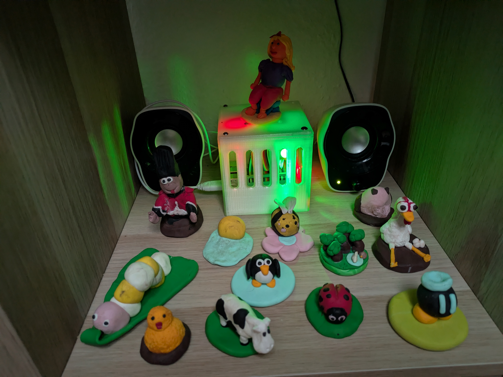
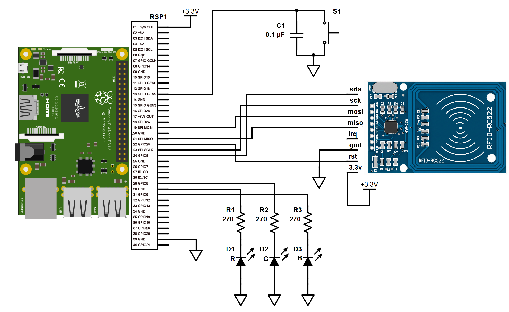

# The Jukebox Project: An Embedded Audio Appliance

**A production-grade, RFID-controlled music player for children, built on modern Raspberry Pi OS.**

*Figure 1: Jukebox*

---

## 📑 Table of Contents
* [📖 The Story](#-the-story)
* [🎮 How It Works](#-how-it-works)
* [🏗️ Architecture Summary](#-architecture-summary) (Full details in [`doc/architecture.md`](./doc/ARCHITECTURE.md))
* [🚀 Setup & Deployment](#-setup--deployment) (Full guide in [`doc/setup.md`](./doc/SETUP.md))
* [📂 Resources (Schematics & 3D Case)](#-resources)

---

## 📖 The Story
This project started as a summer vacation experiment to build a music player for my children. Originally, it was a "vibe-coded" prototype running on a standard Raspberry Pi OS, held together by manual scripts and SD card backups.

While I previously migrated the entire stack to the Yocto Project to harden it into a custom OS image, the transition to Debian 13 (Trixie) and Kernel 6.12+ fundamentally changed how Linux handles hardware GPIO. This repository represents the definitive, modern refactor: it abandons deprecated legacy libraries in favor of `gpiozero` and strict Python virtual environments, delivering appliance like stability on a standard, easily updatable Raspberry Pi OS.

## 🎮 How It Works
The user interaction is designed to be screen-free and intuitive for children:

1.  **Place a Tag:** The system reads the RFID UID and looks it up in `mappings.cfg`. If recognized, it plays the specific folder associated with that toy/card.
2.  **Remove the Tag:** Playback stops immediately.
3.  **Smart Resume:** If the *same* tag is placed again, the system remembers the position and plays the **next** song in the folder (cycling through the album).
4.  **Default Mode:** If an unknown tag is used (or configured as such), the system plays from a "Random Mix" folder.

## 🏗️ Architecture Summary
*   **Hardware:** Raspberry Pi 3B + MFRC522 RFID Reader (SPI) + GPIO LEDs and Controls.
*   **OS:** Raspberry Pi OS (Debian 13 / Trixie).
*   **Application:** Python 3.12+ (Virtual Environment) + VLC (`cvlc`) + Systemd.

> 🔌 **Hardware Details:** For precise header pinouts, component wiring, and a detailed breakdown of the execution flow, please see **[doc/architecture.md](./doc/ARCHITECTURE.md)**.

## 🚀 Setup & Deployment
Deploying this project requires configuring the Pi hardware, setting up a local developer environment, and syncing normalized audio files.

> 🛠️ **Installation Guide:** For step-by-step instructions on setting up the target hardware, installing the Systemd services, and deploying code automatically via VS Code, please see **[doc/setup.md](./doc/SETUP.md)**.

## 📂 Resources
*   **Schematics:**

*Figure 2: Jukebox Hardware Schematic*

*   **[3D Printed Case](./doc/case)**